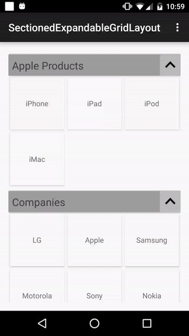

# SectionedExpandableGridRecyclerView

This example project is an attempt at a simple implementation of sectioned, expandable, grid RecyclerView
 

I have used <b>GridLayoutManager</b> to achieve the fuctionality.

<a href = ./app/src/main/java/com/fivido/sectionedexpandablegridlayout/adapters/SectionedExpandableLayoutHelper.java>SectionedExpandableLayoutHelper</a>
class gets the data, puts it in required format and passes it to the <a href= ./app/src/main/java/com/fivido/sectionedexpandablegridlayout/adapters/SectionedExpandableGridAdapter.java>SectionedExpandableGridAdapter</a>

Helper class created allows the addition/removal of a whole section altogether and also provides with the facility to add/remove individual items from an existing section

